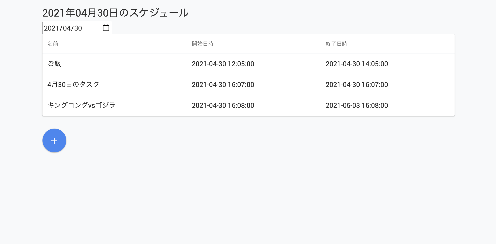

# timeschedule_sample

タイムスケジュールの Web アプリ



```
$ poetry run uvicorn timeschedule.main:app --reload
```

## Test

```
poetry run python -m pytest
```

## CSS Framework

[Propeller Open Source - A Free Front-End UI Framework based on Material Design, Bootstrap &amp; SASS](https://propeller.in/frameworks/open-source/)

## Form

[Form Data - FastAPI](https://fastapi.tiangolo.com/tutorial/request-forms/)
